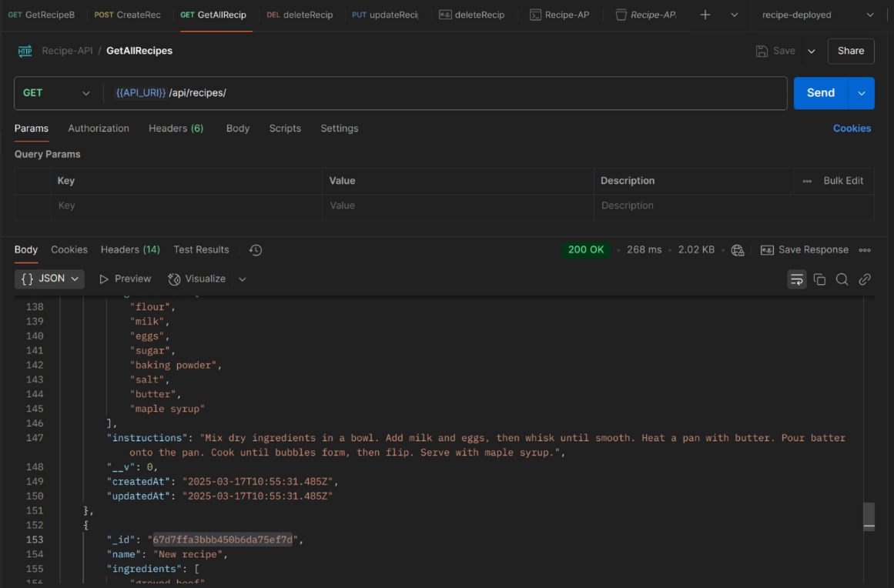

# Recipe Management System API

 
 
 
 
 

This is a **CRUD (Create, Read, Update, Delete)** application designed to manage recipes. It is built using **Node.js**, **Express.js**, and **Mongoose** for MongoDB integration. The application follows the **MVC (Model-View-Controller)** pattern and includes comprehensive API documentation using **Postman**.

 


## Features

* **Create Recipe**: Add a new recipe to the database.
* **Get All Recipes**: Retrieve a list of all recipes.
* **Get Recipe by ID**: Fetch a single recipe by its unique ID.
* **Update Recipe**: Modify an existing recipe by its ID.
* **Delete Recipe**: Remove a recipe from the database by its ID.


## Tech Stack

* **Backend**: Node.js, Express.js
* **Database**: MongoDB (with Mongoose ODM)
* **API Documentation**: Postman
* **Deployment**: Render


## Installation

Follow these steps to set up the project locally:


1. **Clone the repository**:

   ```bash
   git clone https://github.com/tomdu3/recipe-managment.git
   cd recipe-managment
   ```
2. **Install dependencies**:

   ```bash
   npm install
   ```
3. **Set up environment variables**:
   * Create a `.env` file in the root directory.
   * Add the following variables:

     ```
     PORT=3000
     MONGODB_URI=your_mongodb_connection_string
     ```
4. **Run the server**:

   ```bash
   npm start
   ```

   The server will start at `http://localhost:3000`.


## API Endpoints

### Base URL

* `API_URI` variable:
  * for local running: `http://localhost:3000`
  * for deployed API: `https://recipe-management-zzle.onrender.com`

```
{{API_URI}}/api/recipes
```


* The API documentation generated by Postman can be found here: [API Documentation](https://documenter.getpostman.com/view/15625728/2sAYkDLzdm#cfbcbe56-2561-4ec2-acfa-e8e6875bb6e8)

### 1. **Get All Recipes**

* **Endpoint**: `GET /api/recipes`
* **Description**: Retrieves a list of all recipes.
* **Request**: No request body required.
* **Response**:

  ```json
  [
    {
      "_id": "67d7ffa3bbb450b6da75ef75",
      "name": "Spaghetti Carbonara",
      "ingredients": [
        "spaghetti",
        "eggs",
        "Parmesan cheese",
        "bacon",
        "garlic",
        "black pepper",
        "salt"
      ],
      "instructions": "Cook spaghetti according to package instructions. In a bowl, whisk eggs and Parmesan cheese. Cook bacon until crispy, then add minced garlic. Toss cooked spaghetti with the egg mixture and bacon. Season with black pepper and salt.",
      "__v": 0,
      "createdAt": "2025-03-17T10:55:31.484Z",
      "updatedAt": "2025-03-17T10:55:31.484Z"
    },
    {
      "_id": "67d7ffa3bbb450b6da75ef76",
      "name": "Chicken Tikka Masala",
      "ingredients": [
        "chicken breast",
        "yogurt",
        "tomato puree",
        "onion",
        "garlic",
        "ginger",
        "garam masala",
        "turmeric",
        "cumin",
        "coriander",
        "cream",
        "cilantro"
      ],
      "instructions": "Marinate chicken in yogurt and spices for 1 hour. Cook chicken in a pan until browned. Sauté onions, garlic, and ginger. Add tomato puree and spices, then simmer. Add chicken and cream. Garnish with cilantro.",
      "__v": 0,
      "createdAt": "2025-03-17T10:55:31.485Z",
      "updatedAt": "2025-03-17T10:55:31.485Z"
    },...
  ]
  ```


### 2. **Get Recipe by ID**

* **Endpoint**: `GET /api/recipes/:recipeId`
* **Description**: Retrieves a specific recipe identified by the `recipeId`.
* **Request**:
  * `recipeId` (path parameter): The unique identifier of the recipe.
* **Response**:

  ```json
  {
      "_id": "67d7ffa3bbb450b6da75ef77",
      "name": "Beef Tacos",
      "ingredients": [
        "ground beef",
        "taco shells",
        "lettuce",
        "tomato",
        "cheddar cheese",
        "onion",
        "taco seasoning",
        "sour cream",
        "salsa"
      ],
      "instructions": "Cook ground beef with taco seasoning. Warm taco shells. Fill shells with beef, lettuce, tomato, cheese, and onion. Top with sour cream and salsa.",
      "__v": 0,
      "createdAt": "2025-03-17T10:55:31.485Z",
      "updatedAt": "2025-03-17T10:55:31.485Z"
    }
  ```


### 3. **Create Recipe**

* **Endpoint**: `POST /api/recipes`
* **Description**: Adds a new recipe to the database.
* **Request Body**:

  ```json
  {
    "name": "Bruschetta",
    "ingredients": ["baguette", "ripe tomatoes", "fresh basil", "garlic", "extra virgin olive oil", "balsamic vinegar", "salt", "black pepper"],
    "instructions": "Slice the baguette into 1-inch thick pieces. Toast the slices until golden brown. Dice the tomatoes and finely chop the basil. Mince the garlic. In a bowl, mix tomatoes, basil, garlic, a drizzle of olive oil, and a splash of balsamic vinegar. Season with salt and black pepper. Spoon the mixture onto the toasted baguette slices. Serve immediately."
  }
  ```
* **Response**:

  ```json
  {
    "_id": "64f1b2c3e4b0a1a2b3c4d5e6",
    "name": "Bruschetta",
    "ingredients": ["baguette", "ripe tomatoes", "fresh basil", "garlic", "extra virgin olive oil", "balsamic vinegar", "salt", "black pepper"],
    "instructions": "Slice the baguette into 1-inch thick pieces. Toast the slices until golden brown. Dice the tomatoes and finely chop the basil. Mince the garlic. In a bowl, mix tomatoes, basil, garlic, a drizzle of olive oil, and a splash of balsamic vinegar. Season with salt and black pepper. Spoon the mixture onto the toasted baguette slices. Serve immediately.",
    "createdAt": "2023-10-01T12:00:00.000Z",
    "updatedAt": "2023-10-01T12:00:00.000Z",
    "__v": 0
  }
  ```


### 4. **Update Recipe**

* **Endpoint**: `PUT /api/recipes/:recipeId`
* **Description**: Updates an existing recipe identified by the `recipeId`.
* **Request Body**:

  ```json
  {
    "name": "Updated Bruschetta",
    "ingredients": ["baguette", "tomatoes", "basil", "garlic", "olive oil", "balsamic vinegar", "salt", "pepper"],
    "instructions": "Updated instructions for Bruschetta."
  }
  ```
* **Response**:

  ```json
  {
    "_id": "64f1b2c3e4b0a1a2b3c4d5e6",
    "name": "Updated Bruschetta",
    "ingredients": ["baguette", "tomatoes", "basil", "garlic", "olive oil", "balsamic vinegar", "salt", "pepper"],
    "instructions": "Updated instructions for Bruschetta.",
    "createdAt": "2023-10-01T12:00:00.000Z",
    "updatedAt": "2023-10-01T12:05:00.000Z",
    "__v": 0
  }
  ```


### 5. **Delete Recipe**

* **Endpoint**: `DELETE /api/recipes/:recipeId`
* **Description**: Deletes a recipe identified by the `recipeId`.
* **Request**: No request body required.
* **Response**:

  ```json
  {
    "message": "Recipe deleted successfully",
    "recipe": {
      "_id": "64f1b2c3e4b0a1a2b3c4d5e6",
      "name": "Bruschetta",
      "ingredients": ["baguette", "ripe tomatoes", "fresh basil", "garlic", "extra virgin olive oil", "balsamic vinegar", "salt", "black pepper"],
      "instructions": "Slice the baguette into 1-inch thick pieces. Toast the slices until golden brown. Dice the tomatoes and finely chop the basil. Mince the garlic. In a bowl, mix tomatoes, basil, garlic, a drizzle of olive oil, and a splash of balsamic vinegar. Season with salt and black pepper. Spoon the mixture onto the toasted baguette slices. Serve immediately.",
      "createdAt": "2023-10-01T12:00:00.000Z",
      "updatedAt": "2023-10-01T12:00:00.000Z",
      "__v": 0
    }
  }
  ```


## Error Handling

The API includes proper error handling for:

* Invalid request payloads.
* Missing or invalid recipe IDs.
* Database connection issues.


## Postman Documentation

For detailed API documentation, including sample requests and responses, use Postman and import this file: [Recipe-API.postman_collection.json](./Recipe-API.postman_collection.json)


## Deployment

The application is deployed on **Render**. You can access it here:

[Link to the deployed page](https://recipe-management-zzle.onrender.com/api/recipes/)


## License

This project is licensed under the MIT License. See the [LICENSE](LICENSE) file for details.


## Author

[Tomislav Dukez](https://github.com/tomdu3)


Feel free to modify this template to suit your project's specific details!